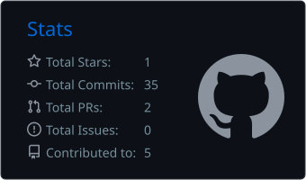
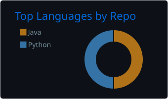

# 👋 Hi, I'm Prashant

### **Information Technology Student | Full-Stack Engineer | Product Builder**

I build digital products at the intersection of **software, design, product thinking, and business**.

I enjoy understanding the problem behind a product, designing the experience, building the system, studying the market, and continuously improving what I create.

---

## 🚀 What I Work On

- 💻 **Software Engineering** — Full-stack applications, APIs, backend systems & automation
- 🎨 **UI/UX & Design** — Interfaces, user flows, design systems & visual design
- 🧠 **Product** — User research, competitor analysis, product reviews & improvement
- 📊 **Research** — Market trends, analytics, reports, reviews & business models
- 🎬 **Media** — Video editing, motion & digital content
- 📈 **Business** — Product strategy, marketing, growth & monetization

---

## 🛠️ Tech Stack

### 💻 Development

### ⚙️ Backend & Infrastructure

### 🎨 Design

### 🎬 Video & Motion

### 🔍 Product & Research

`Google Search` · `Google Trends` · `Google Analytics` · `Microsoft Clarity` · `Hotjar`

`Notion` · `Miro` · `FigJam`

### 📈 Market & Business Research

`Competitor Analysis` · `Market Trends` · `YouTube Trends`

`Annual Reports` · `Budgets` · `Industry News`

`Business Models` · `User Reviews` · `Product Analysis`

---

## 🔍 Product Thinking

I approach products from more than just the technical side.

**Problem → User → Experience → Competition → Market → Business → Improvement**

I study:

- User behavior and feedback
- Reviews and complaints
- Competitor strengths and weaknesses
- Market and media trends
- Industry news and reports
- Business models and monetization
- Product usability and friction

The goal is not simply to add features, but to understand **what should actually be improved and why.**

---

## 🚀 Featured Projects

### Svaansh

**Government Career & Recruitment Platform**

A platform focused on making Indian government jobs, recruitment updates, exams, results, and career information easier to discover and understand.

**Status:** 🚧 Building

`React` `Node.js` `Fastify` `PostgreSQL` `Redis` `Docker`

---

### Java Web Crawler

**Web Data Collection & Extraction**

A Java project exploring web crawling, HTTP requests, data extraction, and structured information processing.

`Java` `Web Crawling` `HTTP` `Data Extraction`

---

### 🔒 Private Projects

Independent product and startup projects currently under development.

Some work remains private until the products are ready to be publicly revealed.

---

## 📊 GitHub Stats

  

  

  

---

## 🎯 What I'm Building Toward

Building **products, brands, and businesses** while developing deep expertise across technology and the disciplines surrounding it.

**Software · Product · Design · Business · Research · Creativity**

> **Build things. Understand people. Improve continuously.**
> *"Sometimes you fail, and that’s okay. You rest, reset, and start building again—things will get better."*
